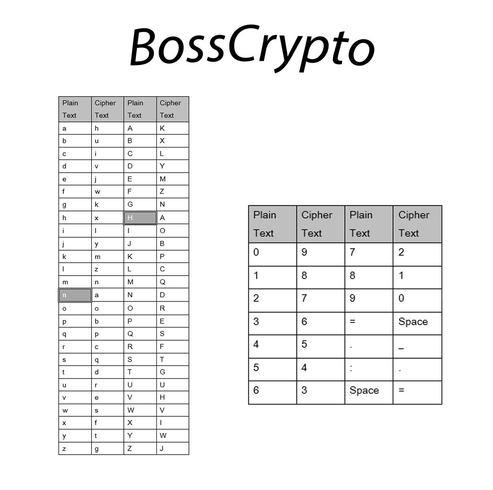

# BossCrypto

**BossCrypto** is a simple cryptographic encoding and decoding tool built using a character mapping technique. This is not an advanced cryptographic method but serves as a basic example of how text can be obfuscated using mappings.

---

## Features

- **Encoding:** Transforms plain text into encoded text using a predefined mapping.
- **Decoding:** Reverts the encoded text back into its original form.
- Supports letters (both uppercase and lowercase), numbers, spaces, and some special characters.

---

## How It Works

The program uses two predefined dictionaries:
1. **`mapping`** - Used for decoding text.
2. **`mapping_2`** - Used for encoding text.

Each character in the input file (`BossCrypto.txt`) is mapped to its corresponding encoded or decoded counterpart based on the selected operation.

### Mapping Technique

Below is the mapping technique used in BossCrypto:



This table illustrates how plain text characters are converted to cipher text characters and vice versa.

---

## How to Use

1. Place the input text to be encoded or decoded in a file named `BossCrypto.txt` in the same directory as the script.
2. Run the script using Python.
3. Select the desired operation:
   - Enter `1` for **Encoding**.
   - Enter `2` for **Decoding**.
4. The result (encoded/decoded text) will be displayed as the "Flag."

---

## Example

### Input (`BossCrypto.txt`)
```
Hello World 123
```

### Encoding Output
```
Flag : Xjxmm=Vmpzm=876
```

### Decoding Output
```
Flag : Hello World 123
```

---

## Installation

1. Clone the repository:
   ```bash
   git clone https://github.com/BlackBossX/BossCrypto.git
   ```
2. Navigate to the directory:
   ```bash
   cd BossCrypto
   ```
3. Run the script:
   ```bash
   python BossCrypto.py
   ```

---

## Limitations

- The mappings are fixed and easily reversible, so this method does not provide strong security.
- The tool is intended for learning and demonstration purposes, not for real-world secure encryption.

---

## Creator
Blaky,
- For support, email malandealwis@gmail.com

---


